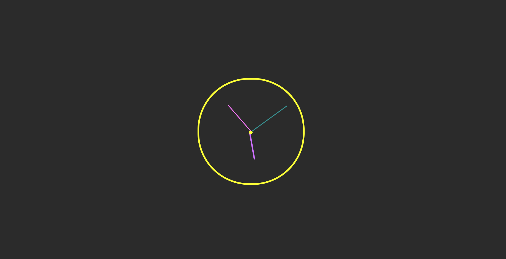

# analog_clock_js

This repository contains a simple yet elegant analog clock implemented using JavaScript, HTML, and CSS. The clock dynamically displays the current time with smooth and accurate movement of the hour, minute, and second hands.

